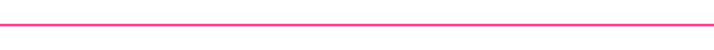
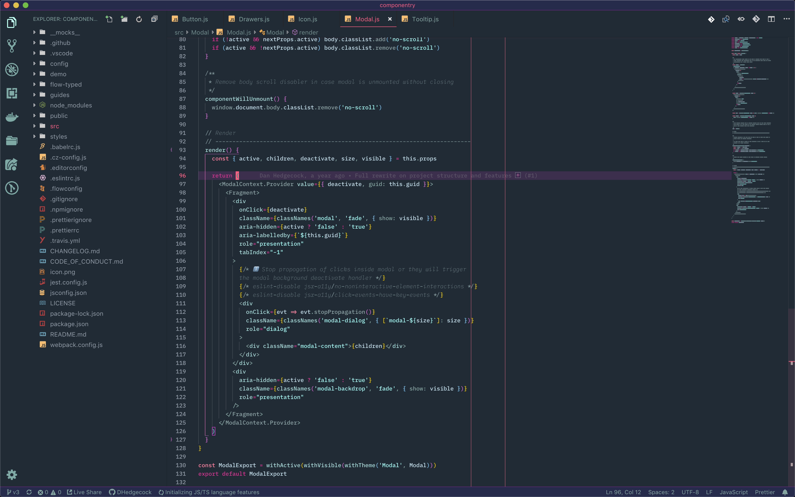

 

  

  

<em>A dark theme for radical hacking inspired by retro futuristic design.</em>

## Theme features

- Looks pretty rad ¯\\\_(ツ)\_/¯
- Git diff background colors optimized for readability

 
 

  

## Coming soon...

- Finishing the workbench theme colors
- Creating a palette for highlight states
- Additional screenshots of theme
