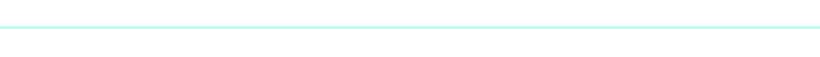
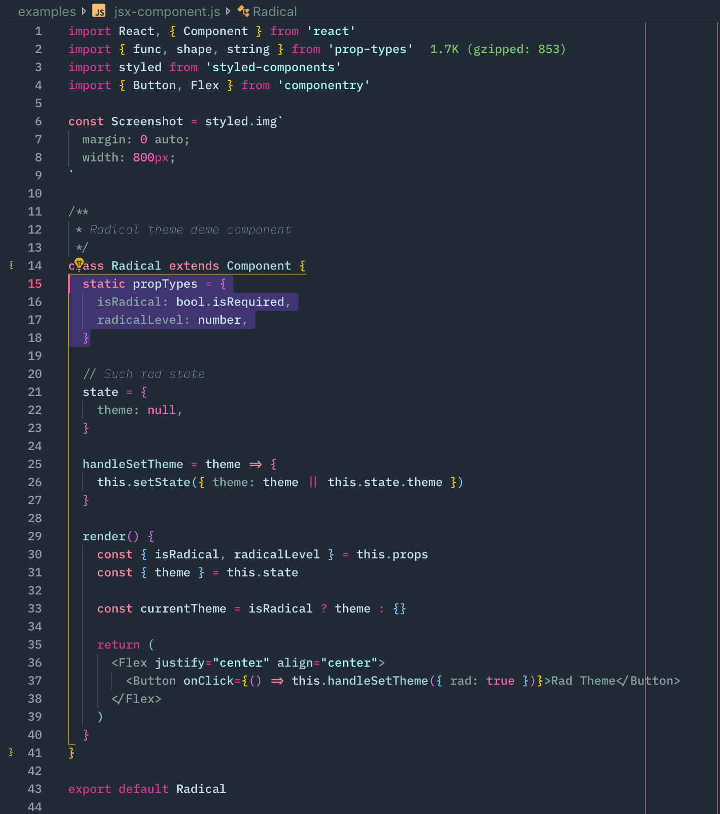
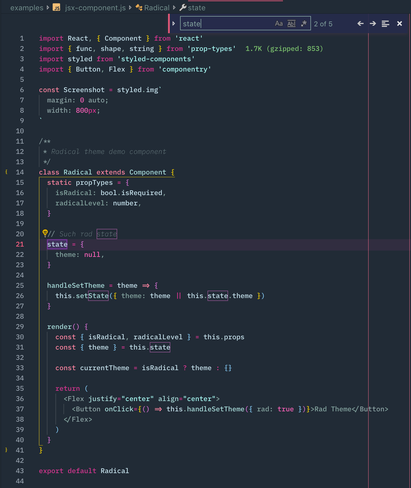

 

  

  

<em>A dark theme for radical hacking inspired by retro futuristic design.</em>

## Theme features

- Looks pretty rad ヘ( ^o^)ノ＼(^\_^ )
- Optimized highlighting backgrounds and opacities for better editor context
- Git diff background colors optimized for readability

 

  

 
 

<h3 align="center">
  <strong>
    Git diff
  </strong>
</h3>

  

Diff background color use a very low opacity for readability when using the diff
editor.

...Coming soon!

<h3 align="center">
  <strong>
    Highlighting
  </strong>
</h3>

  

Highlighting theming is intended to provide useful highlighting colors while
maintaining readability. Many of the highlights can occur at the same time, so
colors were chosen that could be overlain using opacities.

  
  

## Peak View

...Coming soon!

## Coming soon...

- Finishing the workbench theme colors
- Creating a palette for highlight states
- Additional screenshots of theme
